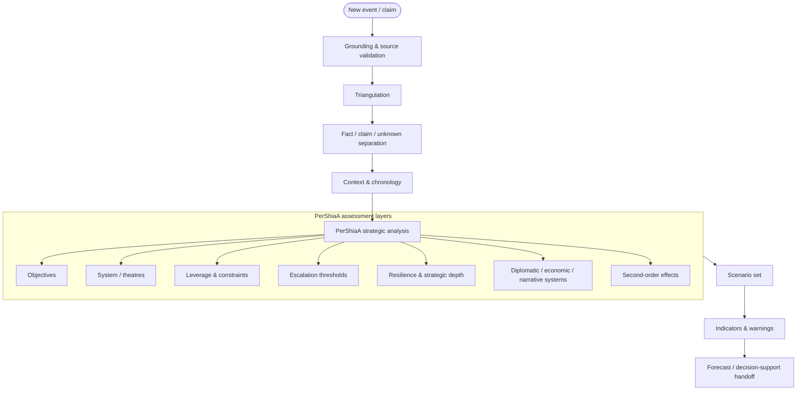

# Iran–Israel Grounding Package — PerShiaA Strategic Intelligence Layer

A source-grounded analytical package for studying the **Iran–Israel–US strategic system** and its surrounding theatres. The repository is designed as an evidence layer for PerShiaA-style strategic analysis: not merely *what happened*, but **what changed in the system, why it matters, which actor gained or lost leverage, what constraints are binding, and which trajectories become more or less plausible**.

> **Analytical identity:** PerShiaA is the interpretive layer. The repository remains evidence-first: facts, claims, assessments, scenarios, and forecasts must remain distinguishable.

## What this repository is for

The package combines five functions:

1. **Grounding** — curated primary, regional, OSINT, analytical, and adversarial sources.
2. **Situation awareness** — timestamped SITREPs and change detection.
3. **Strategic interpretation** — a PerShiaA framework for converting events into strategic meaning.
4. **Scenario analysis** — structured assessment of trajectories, thresholds, and second-order effects.
5. **Forecast handoff** — evidence and assessments for downstream forecasting or decision-support systems.

The core transformation is:

```text
EVENT → EVIDENCE → FACT PATTERN → STRATEGIC CHANGE → LEVERAGE → SCENARIO → IMPLICATION
```

A headline is not a strategic assessment. A military claim is not a fact until its evidentiary status is established. A scenario is not a prediction.

## PerShiaA analytical doctrine

The strategic framework is defined in [`PERSHIAA-STRATEGIC-FRAMEWORK.md`](./PERSHIAA-STRATEGIC-FRAMEWORK.md).

Every serious assessment should interrogate at least these dimensions:

| Dimension | Core question |
|---|---|
| **Strategic objective** | What end-state is each actor trying to make possible? |
| **System position** | How does the event alter the regional balance rather than just the local episode? |
| **Theatre linkage** | Which connected theatres are affected? |
| **Capabilities & constraints** | What can actors sustain, and what limits them? |
| **Leverage** | Who gained or lost coercive, positional, economic, diplomatic, informational, or temporal leverage? |
| **Escalation architecture** | Which thresholds moved, and what pathways or off-ramps changed? |
| **Strategic depth** | How much resilience, redundancy, time, and freedom of action remains? |
| **Economic system** | What changed in sanctions, energy, shipping, insurance, and fiscal endurance? |
| **Diplomatic architecture** | Did coalition support, bargaining space, or veto structures change? |
| **Narrative competition** | Which narratives gained traction and what policy behaviour could they enable? |
| **Second-order effects** | What indirect adaptations may reshape the system? |
| **Indicators & warnings** | Which observable signals could validate or falsify the assessment? |

## Source discipline

The package is **source-grounded, not source-determined**.

- Primary documents anchor factual claims whenever available.
- Opposing framings are compared rather than averaged.
- OSINT is used to test chronology, physical plausibility, geolocation, and material claims.
- Think-tank and media analysis is treated as interpretation, not primary fact.
- Search-layer results are leads until their underlying documents are retrieved and checked.
- Uncertainty is explicit: `Confirmed`, `High`, `Medium`, `Low`, `Claimed`, `Disputed`, or `Unknown`.

See [`AGENTS.md`](./AGENTS.md) for operating rules and [`grounding-set.md`](./grounding-set.md) for the default retrieval surface.

## Analytical pipeline



## Existing monitoring graph

The original 3-hour monitoring architecture remains as the **ingestion and change-detection layer**. It should not be mistaken for the strategic layer itself.

```text
Scheduler → Triage → Retrieval window → Whitelist expansion → Deep research
        → Evidence bundle → SITREP → PerShiaA assessment → Scenario / forecast handoff
```

This is additive: the grounding pipeline handles collection, while PerShiaA supplies the higher-order analytical model.

## Core outputs

### 1. Evidence bundle

Source-backed observations with timestamps, source class, confidence, and claim type.

### 2. SITREP

A concise account of **what changed during the reporting window**.

### 3. Strategic assessment

A structured explanation of **why the change matters and which strategic relationships it modifies**.

### 4. Scenario set

A bounded set of plausible trajectories with assumptions, drivers, constraints, and warning indicators.

### 5. Forecast handoff

A compact representation for downstream forecasting systems.

## Strategic reading order

When a major event arrives, analyze it in this order:

```text
1. What is actually known?
2. What is only claimed?
3. What changed relative to the previous baseline?
4. Which actor's strategic objective does this serve?
5. Which actor's options became wider or narrower?
6. Which theatre linkages changed?
7. Which escalation threshold moved?
8. What second-order effects become plausible?
9. What are the leading alternative explanations?
10. Which indicators would validate or falsify the assessment?
```

## Repository map

- `AGENTS.md` — operating rules for grounded agents.
- `PERSHIAA-STRATEGIC-FRAMEWORK.md` — PerShiaA strategic analytical doctrine.
- `sources.md` — extended whitelist and source metadata.
- `grounding-set.md` — compact default grounding surface.
- `.claude/skills/generate-sitrep/` — SITREP production skill.
- `reference/` — minimal runnable triage → research → writer implementation.

## Design principle

This repository should evolve from a **news-grounding package** into a **strategic intelligence substrate**.

The goal is not to produce more information. The goal is to improve the transformation of information:

```text
MORE SOURCES
      ↓
BETTER EVIDENCE
      ↓
BETTER STRUCTURED CONTEXT
      ↓
BETTER STRATEGIC INFERENCE
      ↓
BETTER SCENARIO DISCIPLINE
      ↓
BETTER FORECASTING
```
